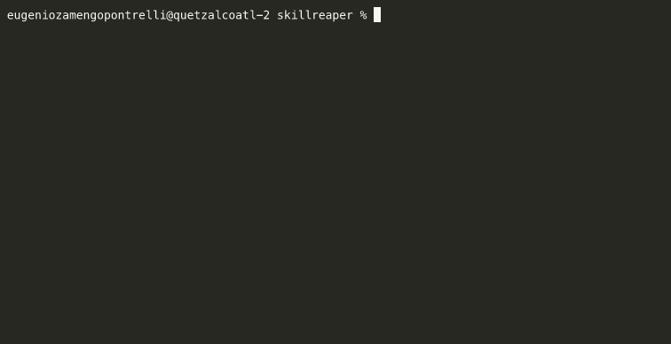

<p align="center">
  
</p>

<h1 align="center">
  Your AI agent reads 187 skill descriptions every session.<br>
  You use 4. Reap the rest.
</h1>
<p>Numbers above are illustrative, run `reap` to see yours.<p>


<p align="center">
  <a href="https://github.com/thousandflowers/skillreaper/actions/workflows/ci.yml"></a>
  <a href="https://github.com/thousandflowers/skillreaper/releases"></a>
  <a href="https://github.com/thousandflowers/skillreaper/issues"></a>
  <a href="https://github.com/thousandflowers/skillreaper/releases"></a>
  <a href="LICENSE"></a>
</p>

<br>

```bash
brew install thousandflowers/tap/skillreaper
reap
```

**One command. Zero config. Read-only.** It scans your transcripts, finds
every skill/agent/MCP your AI loads but never uses, and tells you exactly
what it costs in context window, latency, and money.

<br>

### The problem

Every Claude Code session loads 150–300 skill descriptions, agent configs,
and rule files into context. Most of it is dead weight:

- 187 items scanned
- 142 never used (76 %)
- 8 000 tok/session wasted
- ~2 160 000 tok/month burned on irrelevant instructions

Your agent scrolls through a wall of irrelevant tools looking for the right
one. Wrong picks cost turns. Turns cost tokens. Tokens cost money.

> `reap` points at the waste. You decide what goes.

<br>

### Before → After

| Before skillreaper | After skillreaper |
|---|---|
| 187 items loaded every session | 45 items, all actively used |
| Wrong tool 1 in 5 turns | Right tool on first try |
| 8 000 tok/session dead | Full context budget for real work |
| ~30 pages of irrelevant instructions read monthly | Zero |
| Lower cache hit rate = higher latency | Smaller prompt fits in cache |

<br>

### Install

```bash
# macOS — Homebrew
brew install thousandflowers/tap/skillreaper

# Any platform — Go (Go ≥ 1.22)
go install github.com/thousandflowers/skillreaper/cmd/reap@latest
```

**Binary downloads** — macOS (Intel + Apple Silicon), Linux (amd64 + arm64),
Windows (amd64 + arm64) — all on the
[releases page](https://github.com/thousandflowers/skillreaper/releases).
Single static binary, no dependencies.

Upgrading, uninstalling, and platform-specific tips →
[INSTALL.md](INSTALL.md).

<br>

### Usage

```bash
reap                          # scan + report (read-only)
reap gap                      # loaded-vs-fired utilization breakdown
reap prune                    # quarantine REAP items (reversible)
reap mute <name>              # strip description, keep skill available
reap unmute <name>            # restore description from backup
reap unmute --all             # restore all muted skills
reap keep <name>              # protect an item from pruning
reap restore --all            # undo every prune
reap why <name>               # explain in detail why an item got its verdict
reap by-project               # skills bucketed by the project that fired them
reap manifest <name>          # emit a release manifest for one skill
reap install-hook             # install weekly nudge (SessionStart hook)
reap install-hook --dry-run   # preview without writing
reap uninstall-hook           # remove hook, other hooks untouched
reap --json                   # structured JSON output
reap --md                     # markdown report
reap --days 7                 # shorter evidence window
reap --mute-threshold 0.20    # firing rate below which MUTE triggers (default 20%)
reap version                  # print version
```

Everything is **reversible**. `reap prune` moves files to a `reaped/`
directory with a versioned manifest. Nothing is ever deleted. Run
`reap restore --all` and everything goes back exactly where it was.

<br>

### Verdicts

| Label | Meaning |
|---|---|
| **`REAP(broken)`** | Invoked but errored — broken, not just cold |
| **`REAP`** | Zero uses — safe to quarantine |
| **`MUTE`** | Used rarely + heavy — description stripped, skill stays available |
| **`KEEP`** | Used, tiny, or manually protected |
| **`REVIEW`** | Too new or not enough sessions |

Every verdict includes a reason suffix explaining *why*.

<br>

### Loaded vs fired

Beyond the prune verdicts, `reap gap` shows your **utilization rate** —
how much of what you load you actually use.

```
⟡ loaded vs fired — last 30 days · 142 sessions

CATEGORY   LOADED  FIRED   UTIL   ────────────       TOKENS
skills        187      4    2%    ▰▱▱▱▱▱▱▱▱▱     ~8 000 →   210
mcp            12      3   25%    ▰▰▱▱▱▱▱▱▱▱          ? →     ?
agents         30      2    7%    ▰▱▱▱▱▱▱▱▱▱     ~1 200 →    90
───────────────────────────────────────────────────────────────
total         229      9    4%    ▰▱▱▱▱▱▱▱▱▱     ~9 200 →   300
```

Each row breaks down by category (skill, MCP, agent) with item count, token
weight, and a 10-segment utilization bar. Low utilization (<10 %) is red,
medium (<50 %) yellow, high (≥50 %) green.

The default `reap` report also includes a compact utilization summary line:

```
⟡ utilization 4%  —  9/229 items fired · ~300/9 200 tok touched (30d)
```

This is the **real** gap between what your agent carries and what it fires —
complementary to the shock box (which only counts items that are safe to prune
right now).

<pre>reap gap          # text breakdown
reap gap --json   # JSON output
reap gap --md     # markdown table</pre>

<br>

### Weekly nudge

```bash
reap install-hook
```

Installs a `SessionStart` hook that runs a passive audit at the start of each
Claude Code session. If 7 days have passed and the REAP or MUTE count has grown
since the last check, it prints a single line to stderr:

```
skillreaper: 3 skills flagged for pruning since last check. Run reap to review.
```

Nothing else. No blocking. State stored at `~/.claude/reaped/nudge-state.json`.

`reap uninstall-hook` removes only the skillreaper entry — other hooks untouched.

<br>

### Privacy

**100 % local.** Zero telemetry, zero network, zero uploads. Reads config
files and session transcripts on disk — your data never leaves your machine.

<br>

### Platform support

| Platform | Full support |
|---|---|
| **Claude Code** | ✅ |
| **Codex CLI** | ✅ |
| **Hermes** | ✅ |
| **OpenCode** | ✅ (usage evidence needs the `sqlite3` CLI; inventory-only without it) |
| **Cursor** | Inventory only (no local transcripts) |
| **OpenClaw** | Inventory only (no session history) |

<br>

### How it works

1. **Auto-detect** — probes every known config directory. Only installed
   platforms are scanned. No flags needed.
2. **Inventory** — scans skills, agents, MCP servers, hooks, and prose
   files across all detected platforms.
3. **Evidence** — parses JSONL session transcripts (Claude Code, Codex CLI,
   Hermes). Counts `tool_use` blocks and command invocations with timestamps.
   OpenCode's SQLite history is read via the `sqlite3` CLI (read-only) when it
   is on `PATH`; without it, OpenCode stays inventory-only.
4. **Cost** — character weight (`ceil(chars / 3.7)`) + init parser tool
   declarations. Model pricing auto-resolves by model name.
5. **Verdict** — REAP / KEEP / REVIEW with machine-readable reason.
6. **Act** — `reap prune` quarantines. `reap restore --all` undoes.

<br>

### Limitations (transparency)

**Token counts are approximate.** The tool estimates tokens as
`ceil(chars / 3.7)`, based on the average English BPE tokenizer rate.
Real token counts vary by tokenizer (Claude vs GPT vs Gemini) and content
(more code ≈ more tokens per char). This is a documented approximation —
the relative ranking matters more than the absolute number.

**Platform format stability.** Each supported platform has its own config
layout and transcript format. These change over time as platforms evolve.
Parser updates are an ongoing maintenance reality. The project is architected
for easy fixes (one struct per platform in `internal/platform/`), but format
changes can lag by days to weeks after a platform update.

**OpenCode evidence needs the `sqlite3` CLI.** OpenCode stores session history
in a SQLite database. skillreaper reads it through the system `sqlite3` binary
in read-only mode — the real engine, so WAL-mode databases and overflow pages
are handled correctly (a hand-rolled parser would not). No Go dependency is
added. When `sqlite3` is **not** on `PATH`, OpenCode items have no usage
evidence: they stay **REVIEW (never REAP)** with a warning at scan time. The
same safety net applies to any platform with no readable session transcripts.

**Not a tool declaration fix.** Claude Code's deferred tools reduce the
*init-time tool declaration* overhead. Skillreaper addresses a different
problem: **always-loaded skill/agent/prose files.** If a skill description
is 248 characters, it is read into context every session — regardless of
lazy tool loading. These two optimizations are complementary, not competing.

<br>

### Design

- **100 % local**, zero dependencies, single static binary (Go ≥ 1.22)
- **Multi-platform** — adding a new platform is one struct in
  `internal/platform/`
- **Reversible quarantine** — never deletes, never destructive
- **MIT licensed**

```
cmd/reap/       CLI entry point
internal/
  platform/     platform definitions + auto-detection
  scan/         inventory scanners (claudemd.go: CLAUDE.md protection)
  usage/        transcript parser — tool_use + error tracking
  report/       verdict logic (REAP/MUTE/KEEP/REVIEW) + ANSI/JSON/MD renderers
  prune/        reversible quarantine
  mute/         description strip + backup/restore
  hook/         SessionStart install/uninstall + nudge state
  cost/         model pricing
docs/           demo assets
```

<br>

---

### Acknowledgements

v0.2.0 ideas were inspired by work from the r/claudeskills community:

- **[groundskeeper](https://github.com/zvoque/groundskeeper)** — SessionStart weekly nudge pattern and live usage tracking approach
- **[optimize](https://github.com/codeprakhar25/optimize)** — name-only middle state (implemented as MUTE) and CLAUDE.md reference protection
- Broken-vs-cold distinction direction inspired by discussion on r/claudeskills

<br>

<p align="center">
  <a href="https://github.com/thousandflowers/skillreaper/issues">Issues</a>
  ·
  <a href="https://github.com/thousandflowers/skillreaper/discussions">Discussions</a>
  ·
  <a href="https://github.com/thousandflowers/skillreaper/releases">Releases</a>
  ·
  <a href="LICENSE">MIT</a>
</p>
